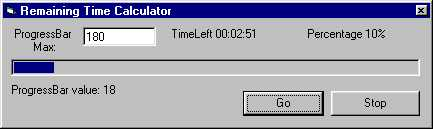



## Calculate Remaining Time for a ProgressBar to Complete

### Description

This calculates the average time taken for a progressbar to get to its current percentage and calculates how much time it will take for the progressbar to reach 100%
 
### More Info
 
ProgressBar Value, ProgressBar Max, Percentage(includes ProgressBar percentage calculation function)

All you do is:

1.) Declare a variable in the (General) area of your form as a string

2.) When the progressbar starts call 'BeginProgress'

3.) When ever you make the progressbars value increase get the percentage with the 'getPercentage' function then call the 'TimeRemaining' function

4.) Voila! You will have the approxamate remaining time for your progressbar.

Returns the percentage completed for a progressbar and the how much time is remaining for a progressbar to get to 100%

             |
---                |---
**Submitted On**   |2000-10-26 16:54:28
**By**             |[KCain](https://github.com/Planet-Source-Code/PSCIndex/blob/master/ByAuthor/kcain.md)
**Level**          |Beginner
**User Rating**    |4.5 (49 globes from 11 users)
**Compatibility**  |VB 6\.0
**Category**       |[Math/ Dates](https://github.com/Planet-Source-Code/PSCIndex/blob/master/ByCategory/math-dates__1-37.md)
**World**          |[Visual Basic](https://github.com/Planet-Source-Code/PSCIndex/blob/master/ByWorld/visual-basic.md)
**Archive File**   |[CODE\_UPLOAD1097210262000\.zip](https://github.com/Planet-Source-Code/kcain-calculate-remaining-time-for-a-progressbar-to-complete__1-12312/archive/master.zip)

